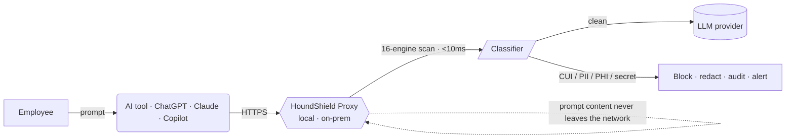

<div align="center">


# HoundShield

**The local-only AI compliance firewall.**

Scan every AI prompt for CUI, PII, PHI, and secrets in **&lt;10&nbsp;ms** — on your own network. Nothing leaves the building.

<br/>

[](https://github.com/thecelestialmismatch/HoundShield/actions/workflows/ci.yml)
[](LICENSE)


[**Website**](https://www.houndshield.com) · [**Pricing**](https://www.houndshield.com/pricing) · [**Contributing**](CONTRIBUTING.md) · [**Report a Vulnerability**](SECURITY.md)

</div>

---

## Why HoundShield

Every cloud AI data-loss tool — Nightfall, Strac, Microsoft Purview — scans your prompts by **first sending them to the vendor's servers.** For a defense contractor, that transmission is itself a **DFARS 252.204-7012 CUI spill.** You cannot scan Controlled Unclassified Information for compliance by violating compliance.

HoundShield runs the scan **locally.** Prompt content never leaves the customer network. That is the entire pitch — and the only architecture that is honest about CUI.

> Built for **Jordan** — the IT Security Manager at a 50–250 person DoD contractor staring down the **CMMC Level 2 deadline of November 10, 2026.** ~80,000 contractors need it. A few hundred are certified today. The clock is the product.

---

## What it does

| Capability | Detail |
| :--- | :--- |
| 🛡️ **16 detection engines** | CUI, PII, PHI, and secret patterns scanned inline on every prompt |
| ⚡ **&lt;10&nbsp;ms local scan** | Pattern matching runs on-prem — no round trip to a vendor cloud |
| 📊 **SPRS scoring** | Live score across all **110 NIST 800-171 Rev 2** controls |
| 🔗 **Tamper-evident audit** | SHA-256 hash-chained log — every decision provable, nothing editable after the fact |
| 📄 **C3PAO-ready PDF** | One-click assessment export your assessor can actually use |
| 🚫 **Inline policy** | Block, redact, or warn — enforced before the prompt reaches the model |

---

## How it works



The proxy sits between your people and whatever model they use. It inspects the request locally, applies policy, writes a hash-chained audit entry, and only then — if the content is clean — forwards it. Detection happens where your data already lives.

---

## Deployment modes

| Mode | Hosting | CUI-safe? | Use it for |
| :--- | :--- | :---: | :--- |
| **A** | Vercel-hosted ([houndshield.com](https://www.houndshield.com)) | ❌ **No — demo only** | Evaluation and sales demos. **Never send real CUI through Mode A.** |
| **B** | Self-hosted Docker | ✅ Yes | Production defense workloads on your own network |
| **C** | Air-gapped | ✅ Yes (IL-5+) | Classified or fully disconnected environments |

> **Mode A is a hosted demo and is not CUI-safe.** It exists so buyers can try the product. Production CUI handling requires Mode B (self-hosted) or Mode C (air-gapped).

---

## Quick start

**Mode B — the proxy (the actual product):**

```bash
cd proxy
cp .env.example .env        # set your license + upstream config
docker compose up -d        # HTTPS intercept proxy comes up locally
```

**The dashboard / control center:**

```bash
cd compliance-firewall-agent
npm install
npm run dev                 # http://localhost:3000
```

**Verify before shipping:**

```bash
cd compliance-firewall-agent
npm run build               # must pass
npm test                    # 400+ tests, must stay green
```

---

## Tech stack

**Application** — Next.js 15 · React 19 · TypeScript (strict) · Tailwind CSS · Framer Motion · Recharts · Supabase (auth + Postgres) · Stripe.

**Proxy** — Node.js HTTPS intercept · deterministic pattern scanner (16 engines) · OODA-loop rate/anomaly tracker · Docker / docker-compose · air-gap-capable.

---

## Compliance coverage

- **NIST SP 800-171 Rev 2** — all 110 controls, mapped and scored
- **CMMC Level 2** — readiness and SPRS self-assessment support
- **DFARS 252.204-7012** — local-only architecture avoids the scan-time CUI spill
- **HIPAA** — PHI detection patterns
- **SOC 2** — control mapping

> HoundShield is **compliance tooling, not a certification.** C3PAOs assess; HoundShield prepares the evidence, the score, and the audit trail.

---

## Project structure

```
compliance-firewall-agent/   Next.js app — dashboard, API, Brain AI, classifier
proxy/                       HTTPS intercept proxy (the product)
  patterns/                  16 CUI/PII/PHI/secret detection engines (extend, never reduce)
  ooda/                      observe → orient → decide → act rate engine
supabase/                    database migrations
docs/                        PRD, roadmap, setup, compliance references
```

CI enforces a hard floor: the **Compliance Pattern Guard** fails any change that drops the engine below 16 patterns. The compliance engine is never silently degraded.

---

## Pricing

Free → **Pro** → **Growth** → **Enterprise** → **Agency**. Current tiers and pricing live at **[houndshield.com/pricing](https://www.houndshield.com/pricing)**.

---

## Contributing & security

- **Contributing** — see [CONTRIBUTING.md](CONTRIBUTING.md). Builds must pass and the pattern count must never drop below 16.
- **Security** — found a vulnerability? **Do not open a public issue.** Follow the disclosure process in [SECURITY.md](SECURITY.md).
- **Code of Conduct** — [CODE_OF_CONDUCT.md](CODE_OF_CONDUCT.md).

---

## License

[MIT](LICENSE) © Kaelus.Online

<div align="center">
<br/>
<strong>Scan locally. Spill nothing.</strong>
</div>
