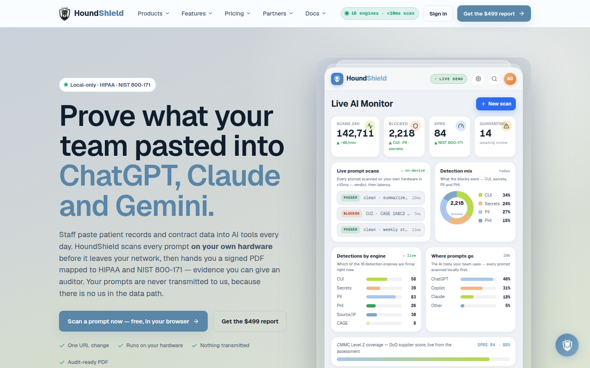
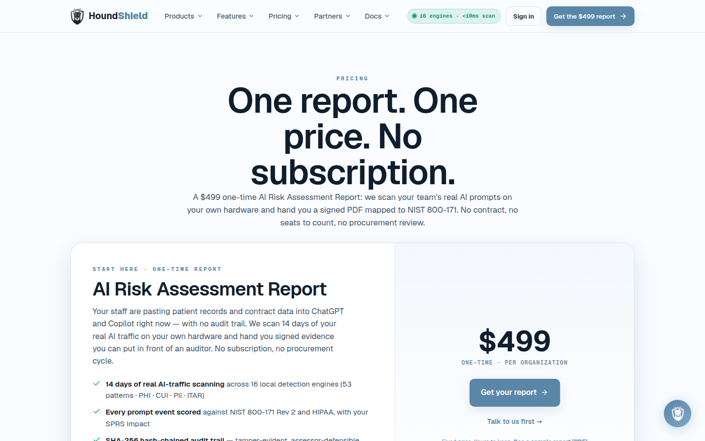
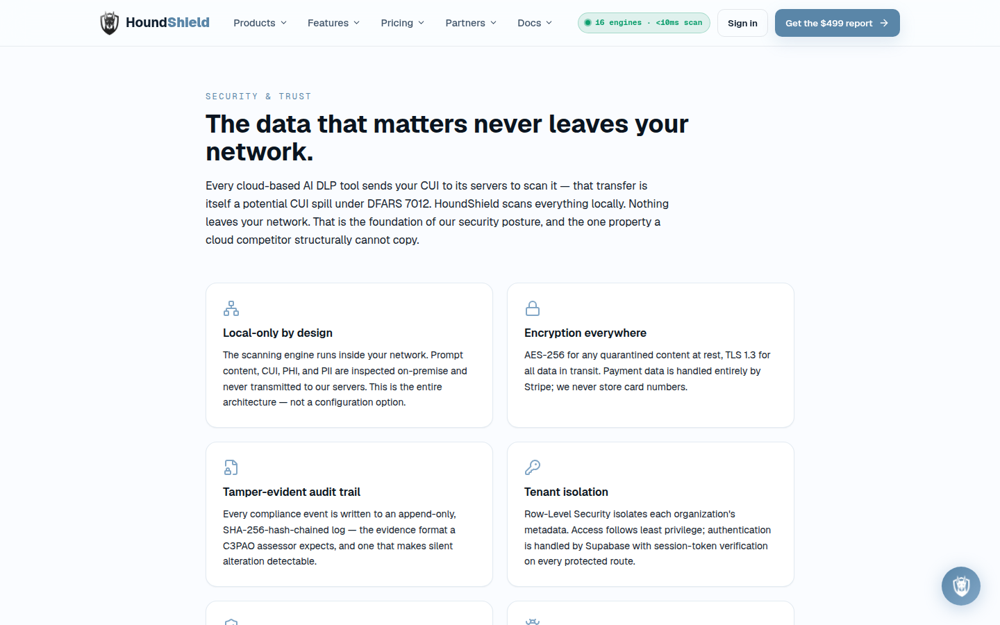
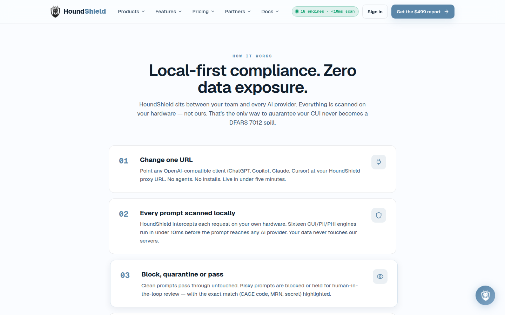
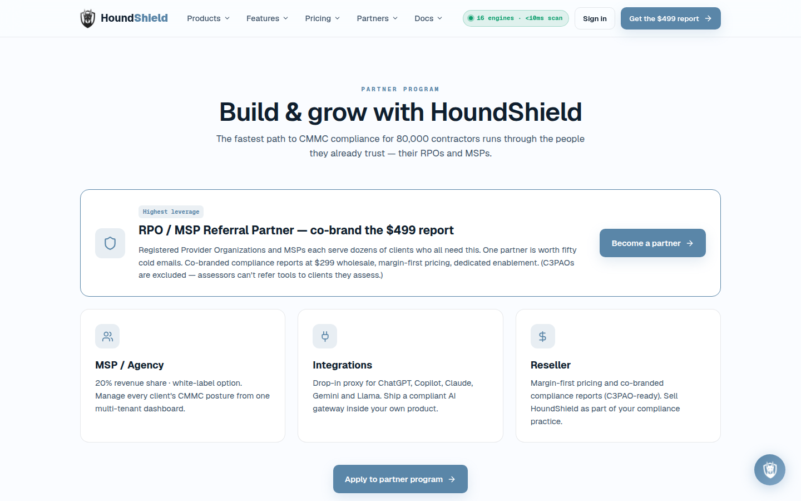
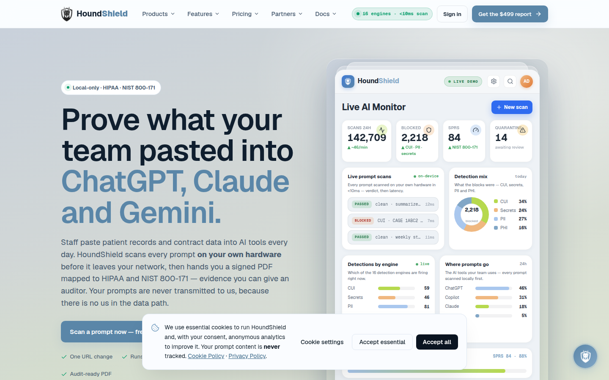

<div align="center">


# HoundShield

**The local-only AI compliance firewall.**

Scan every AI prompt for PHI, CUI, PII and secrets — on your own hardware.
Nothing leaves the building.

<br/>

[](https://github.com/thecelestialmismatch/HoundShield/actions/workflows/ci.yml)
[](LICENSE)


[**Website**](https://www.houndshield.com) · [**Try the scanner**](https://www.houndshield.com/demo#snapshot) · [**Testing guide**](docs/TESTING-GUIDE.md) · [**Roadmap**](docs/ROADMAP-12-MONTH.md) · [**Security**](SECURITY.md)

</div>

---

## Why HoundShield

Every cloud AI data-loss tool — Nightfall, Strac, Microsoft Purview — scans your prompts
by **first sending them to the vendor's servers.** In a regulated environment that
transmission is itself the disclosure you were trying to prevent: a DFARS 252.204-7012
CUI spill for a defense contractor, an undocumented PHI disclosure under the HIPAA
Privacy Rule for a clinic.

You cannot scan regulated data for compliance by violating compliance.

HoundShield scans locally. In self-hosted mode there is no "us" in the data path.

## What it looks like

Captured from a production build of this repo (`npm run build` → standalone
server), not mockups. Regenerate them at any time — see
[docs/assets/README.md](docs/assets/README.md).

<div align="center">



</div>

| | |
|---|---|
|  |  |
| **Pricing** — one grid, $499 report as the lead | **Security** — how prompt data is handled |
|  |  |
| **How it works** — the interception path | **Partners** — the RPO / MSP program |

### Cookie consent

Analytics stay off until the visitor opts in — the banner blocks nothing and
sets no analytics cookie by default, and the choice is revocable from
[/cookies](https://www.houndshield.com/cookies).

<div align="center">



</div>

### Demo

**There is no recorded demo video in this repository yet** — the honest status,
rather than a broken link. What exists today:

- The live interactive scanner: [houndshield.com/demo](https://www.houndshield.com/demo#snapshot)
- The verbatim script a recording should follow: [docs/DEMO-SCRIPT.md](docs/DEMO-SCRIPT.md)

The demo ends on the generated PDF, every time. Recording it requires the proxy
running against a real assistant session, which cannot be produced from CI.

## Verified numbers

Not marketing figures — reproduce every one with the commands in
[docs/TESTING-GUIDE.md](docs/TESTING-GUIDE.md).

| Claim | Measured | Reproduce with |
|---|---|---|
| Scan latency | **p99 0.492 ms** (budget 10 ms) · mean 0.105 ms over 2,000 cold scans | `cd proxy && npm run bench` |
| Detection coverage | **90 patterns** (53 builtin · 17 CMMC · 20 HIPAA) across **16 engines** | `lib/detection/engines.ts` |
| App test suite | **2,648 passing** / 192 files | `cd compliance-firewall-agent && ./node_modules/.bin/vitest run` |
| Proxy test suite | **61 passing** | `cd proxy && npx vitest run` |

Engine and pattern counts shown in the UI are **computed from the shipped registries**, so
a marketing claim cannot silently drift from the code.

## Deployment modes — read before claiming compliance

| Mode | Runs on | CUI/PHI-safe? | Use for |
|---|---|---|---|
| **A — Hosted** | Vercel | ❌ **No** — not FedRAMP-authorized | Demo, non-CUI evaluation |
| **B — Self-hosted** | Your infrastructure (Docker) | ✅ Data never leaves your boundary | CUI and PHI workloads |
| **C — Air-gapped** | Your isolated network | ✅ | IL-5+, enterprise |

**Only Modes B and C are CUI-safe.** The marketing and dashboard plane runs on Vercel —
fine for a website, not fine for a regulated data path. The site says so too.

## Regulatory status (updated 2026-07-28)

**CMMC Phase 2 was suspended on 13 July 2026** by the Department of War. The 10 November
2026 third-party (C3PAO) certification gate no longer applies; Phases 3–4 are frozen
pending a 60-day review.

**What did not change:** DFARS 252.204-7012, the 110 NIST SP 800-171 Rev 2 controls, and
**annual SPRS self-attestation** all remain in force. With no assessor in the loop, that
score is the contractor's own representation to the government — and DOJ's Civil
Cyber-Fraud Initiative has settled 15 False Claims Act cases over exactly that.

## Quickstart

```bash
git clone https://github.com/thecelestialmismatch/HoundShield.git
cd HoundShield

# The product — the local scanning proxy
cd proxy && npm install && npm run dev

# The web plane — marketing, checkout, evidence export
cd ../compliance-firewall-agent && npm install && npm run dev
```

Point your AI client's base URL at the proxy and send a prompt; anything sensitive is
flagged before it leaves the machine.

> **Docker (Mode B):** `proxy/Dockerfile` builds today, but `houndshield/proxy:latest` is
> **not yet published**. Publishing needs the `DOCKERHUB_USERNAME` / `DOCKERHUB_TOKEN`
> repo secrets plus a `proxy-v*` tag — `.github/workflows/docker-publish.yml` does the rest.

## Repository map

```
compliance-firewall-agent/   Next.js 15 · React 19 — marketing, checkout, dashboard
  app/                       App Router — public pages, /console, 59 API routes
  lib/classifier/            90 detection patterns (builtin · CMMC · HIPAA)
  lib/detection/engines.ts   Single source of truth for engine + pattern counts
  lib/reports/               PDF generation + SHA-256 evidence chain
  lib/billing/               Entitlements + PURCHASABLE_OFFER (what is actually for sale)

proxy/                       Node.js HTTPS intercept — THE PRODUCT
  patterns/index.ts          33 standalone patterns (extend, never replace)
  scanner.ts                 The hot path — benchmarked on every CI run
  ooda/                      Observe/orient/decide loop + SQLite audit store

docs/                        STRIPE-FIX · TESTING-GUIDE · ROADMAP-12-MONTH ·
                             SECURITY-ROTATION · OUTREACH-HEALTHCARE
```

## Tech stack

Versions are the installed majors; `compliance-firewall-agent/package.json` and
`proxy/package.json` are the source of truth if this table drifts.

### Web plane — `compliance-firewall-agent/`

| Layer | Choice | What it does here |
|---|---|---|
| Language | **TypeScript 5**, `strict: true` | The build does **not** gate on type errors (`next.config` sets `typescript.ignoreBuildErrors`), so `npx tsc --noEmit` is a separate, required check. |
| Framework | **Next.js 16** (App Router) | Server Components by default. Credential handling lives in server routes under `app/api/auth/` — that is what gives rate limiting, lockout and response-timing control somewhere to attach. |
| UI | **React 19**, **Tailwind CSS 3.4**, Framer Motion, Recharts, Lucide | Public pages are light-mode `hermes.css`; `/command-center` is dark. |
| Database | **Supabase Postgres** (`@supabase/supabase-js`, `@supabase/ssr`) | Row-level security. Schema changes are numbered files in `supabase/migrations/`, applied in order. |
| Auth | **Supabase Auth (GoTrue)** primary · **Better Auth 1.6** for SSO/2FA surfaces | Password hashing is GoTrue's **bcrypt**. The application never hashes a password itself — verified: no MD5/SHA-1 or raw-SHA-256 password path exists in `lib/` or `app/`. |
| Validation | **Zod 4** | Every credential route parses its body through a schema before the value is used. |
| Email | **Resend** | Reset and verification mail is generated and sent by us (`generateLink` + Resend), so the flow needs no Supabase-dashboard template config. |
| Payments | **Stripe 22** | The $499 one-time report. |
| Tests | **Vitest 4** | 2,648 tests across 192 files. |
| Monitoring | **Sentry**, **PostHog** | PostHog is gated on cookie opt-in. |

### Proxy — `proxy/` (the shipped product)

**Node.js + Express 5**, **better-sqlite3** for the local append-only audit
store, **Zod** for config validation. No network dependency on HoundShield —
prompt content never leaves the customer's network.

### The auth flow, module by module

Server-side unless noted.

| Module | Responsibility |
|---|---|
| `lib/auth/credential-guard.ts` | Zod schemas plus the shared per-IP / per-address gate every credential route calls first. |
| `lib/auth/lockout.ts` | Consecutive-failure account lockout (5 attempts → 15 min), keyed on a SHA-256 of the address so the lock itself cannot confirm an account exists. NIST 800-171 **3.1.8** / CMMC **AC.2.008**. |
| `lib/auth/timing.ts` | Equalizes response latency to a 600 ms floor plus jitter, closing the bcrypt-vs-no-bcrypt timing oracle. |
| `lib/auth/captcha.ts` | Turnstile verification, required after repeated failures. |
| `lib/auth/auth-error-message.ts` | The single neutral message every sign-in failure returns. |
| `lib/auth/signup-result.ts` | Same contract for sign-up — never echoes "already registered". |
| `lib/auth/server-auth-client.ts` | Browser caller; treats `501` as "feature off, use the legacy path". |
| `lib/rate-limit-shared.ts` | Postgres-backed counters shared across instances, with a local fail-open fallback. |
| `lib/auth/session.ts` | The one place the app asks "who is the caller?". Normalizes Supabase and Better Auth into a `SessionUser`, including `emailVerified`. Wrapped in React `cache()` — memoized per request, never across requests. |
| `lib/auth/api-guard.ts` | `requireUser()` / `requireRole()`. Fails closed: no session → `401`; session whose address is unproven → `403 email_unverified`. This is where "an account is not active until the email is verified" is actually enforced, rather than being a property of a Supabase dashboard toggle. |
| `lib/auth/audit-log.ts` | Append-only authentication audit trail (`auth_audit_events`, migration 032). NIST 800-171 **3.3.1 / 3.3.2**, CMMC **AU.2.041**. Keyed on an email hash and written whether or not the address resolves, so a row proves an *attempt*, never an account. Fails open (an audit outage must not become an auth outage) but logs at error level, because silence would make "no rows" look like "no attacks". |

### Supporting guards outside the credential routes

| Module | Responsibility |
|---|---|
| `lib/net/safe-fetch.ts` | SSRF bound for any URL that arrives in a request body. Resolves the hostname and judges every returned address against the private/reserved blocklist (IPv4, IPv6, and IPv4-mapped IPv6), re-validates each redirect hop, and caps response size and time. Resolution rather than hostname matching, because a name an attacker controls can point anywhere. |
| `lib/brain-ai/route-guard.ts` | `guardBrainAi()` — the shared authenticate-then-meter front half of every `/api/brain-ai/*` handler, plus `scopedSessionId()`, which namespaces a session id to its owner so a supplied `?id=` can only address the caller's own row. |
| `lib/brain-ai/allowed-models.ts` | Server-side allow-list for the caller-supplied `model` field, derived by filtering the existing pricing table on an output-price ceiling. A request field must never select what we are billed for. |

Rollback: `AUTH_SERVER_ROUTES=off` makes the server credential routes answer
`501` and the browser reverts to its previous direct-to-Supabase calls. It is
read server-side, so flipping it takes effect **without a rebuild**.

## Testing

```bash
cd compliance-firewall-agent && ./node_modules/.bin/vitest run   # 2648 tests
cd proxy && npx vitest run                                       # 61 tests
cd proxy && npm run bench                                        # p99 < 10ms gate
cd compliance-firewall-agent && npm run build                    # must pass pre-deploy
curl -s https://www.houndshield.com/api/health                   # live smoke test
```

Two traps that cost real debugging time — **both exit 0 while failing**:

- Never pass `--reporter=basic` to vitest (fails with `ERR_LOAD_URL`).
- Never run `npx vitest` from the repo root — it loads the *parent* repo's config and
  tests nothing. Always `cd` into the package first.

**Read the last lines of output. Never trust an exit code from a piped command.**

Proxy tests failing with `NODE_MODULE_VERSION` is a stale native binary, not a code bug:

```bash
cd proxy && npm rebuild better-sqlite3
```

## Pricing

**One offer: a $499 one-time AI Risk Assessment Report.** No subscription, no per-seat
licence, no contract. $499 sits below most corporate-card and signature thresholds, so it
does not need procurement approval. The in-browser scanner at `/demo` is free and needs
no account.

## Status — honest

**Working:** the scanner, 16 detection engines, the SHA-256 audit chain, the PDF
generator, the in-browser demo, auth, both test suites, the production build.

**Broken or missing:**
- **Checkout** — `/api/health` reports `payments: malformed_key`. Fix: [docs/STRIPE-FIX.md](docs/STRIPE-FIX.md)
- **Distribution** — `houndshield/proxy:latest` unpublished, so a customer cannot install Mode B
- **Zero paying customers** — the real gap, and not an engineering one

## Contributing

Both test suites and `npm run build` must pass before a commit. Never push to `main`
directly. See [CONTRIBUTING.md](CONTRIBUTING.md) and [SECURITY.md](SECURITY.md).

## License

MIT — see [LICENSE](LICENSE).
