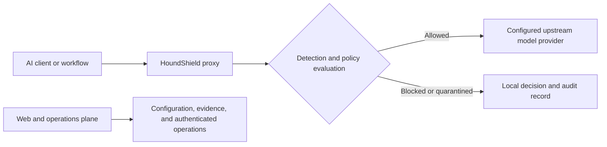

<div align="center">


# HoundShield

**Evidence-first controls for AI data-handling workflows.**

[](https://github.com/thecelestialmismatch/HoundShield/actions/workflows/ci.yml)
[](SECURITY.md)
[](LICENSE)

[Website](https://www.houndshield.com) · [Live evaluation](https://www.houndshield.com/demo) · [Documentation](docs/README.md) · [Support](SUPPORT.md) · [Security](SECURITY.md) · [Contributing](CONTRIBUTING.md)

</div>

---

HoundShield is an open-source project for placing inspectable controls in front of AI-assisted workflows. The repository contains a local scanning proxy and the web, operational, and evidence surfaces that support evaluation and deployment. It is designed to make its boundaries, implementation, and validation procedures visible rather than relying on unqualified marketing claims.

> **Important:** This repository is software, not a compliance certification or an authorization to process regulated data in every deployment. Validate the selected deployment, its configuration, its upstream providers, and your organization’s policies before handling CUI, PHI, or other sensitive data.

## What is in this repository

| Component | Location | Purpose |
|---|---|---|
| **Scanning proxy** | [`proxy/`](proxy/) | OpenAI-compatible interception path, detection patterns, block/quarantine decisions, local audit records, and latency benchmarks. |
| **Web and operations plane** | [`compliance-firewall-agent/`](compliance-firewall-agent/) | Next.js website, authenticated dashboard, API routes, operational health, evidence/reporting features, and application schema migrations. |
| **Documentation** | [`docs/`](docs/README.md) | Deployment, testing, security-hardening, integration, operational, and product reference material. |
| **Repository automation** | [`.github/`](.github/) | CI, secret/PII checks, dependency updates, issue templates, and pull-request checks. |

The proxy and web plane solve different problems. The proxy is the component intended to sit in the request path. The hosted website and evaluation experience are not a substitute for a self-hosted control boundary.

## Deployment boundaries

Choose a deployment mode deliberately. The hosted experience is intended for product evaluation and public information; it should not be treated as an authorized environment for regulated workloads. A customer-operated deployment can support a different control boundary, but the operator remains responsible for configuration, validation, access control, logging, retention, and their upstream model-provider relationship.

| Deployment context | Appropriate use | Decision point |
|---|---|---|
| **Hosted website and evaluation** | Product discovery, documentation, and non-sensitive evaluation | Do not submit CUI, PHI, or customer secrets. |
| **Customer-operated proxy** | Integrating the scanner with an organization-controlled AI workflow | Validate infrastructure, egress, credentials, policies, and evidence handling before use. |
| **Restricted or isolated environment** | Environments with additional network or handling constraints | Establish the deployment architecture and operating procedures with the responsible security team. |

See the [deployment guidance](docs/deploy-production.md), [security-hardening guide](docs/security-hardening.md), and [testing guide](docs/TESTING-GUIDE.md) before making environment-specific claims.

## Architecture at a glance


```mermaid
flowchart LR
    A["AI client or workflow"] --> B["HoundShield proxy"]
    B --> C{"Detection and policy evaluation"}
    C -->|"Allowed"| D["Configured upstream model provider"]
    C -->|"Blocked or quarantined"| E["Local decision and audit record"]
    F["Web and operations plane"] --> G["Configuration, evidence, and authenticated operations"]
```

The diagram describes the project’s intended component roles. Actual data handling depends on the deployment mode and configuration; review the code, configuration, and validation material for the environment you operate.

## Quick start for local development

**Requirements:** Node.js 22 and npm. The CI workflow uses Node 22 for both packages, and it is the supported local baseline.[^ci]

```bash
# Clone the repository
git clone https://github.com/thecelestialmismatch/HoundShield.git
cd HoundShield

# Start the web and operations plane
cd compliance-firewall-agent
cp .env.example .env.local
# Populate only development credentials in .env.local; never commit it.
npm ci
npm run dev
```

In a second terminal, start the local proxy:

```bash
cd HoundShield/proxy
cp .env.example .env.local
# Review the template and configure a non-production local environment.
npm ci
npm run dev
```

The sample environment files document required values. Do not use production credentials in a local checkout, commit `.env.local`, or place sensitive prompts in public issues, pull requests, or logs.

## Verify a change

The commands below mirror the checks enforced by the repository’s CI workflow. Run the checks for every component you modify.[^ci]

| Component | Required local checks |
|---|---|
| **Web and operations plane** | `cd compliance-firewall-agent && npm ci && npx tsc --noEmit && npm run lint && npm run test:coverage && npm run build` |
| **Scanning proxy** | `cd proxy && npm ci && npm run lint && npm run test:coverage && npm run bench && npm run build` |
| **Tracked files** | CI runs a secret/PII guard and a compliance-pattern guard on every pull request. |

For deeper test scenarios, troubleshooting, smoke checks, and benchmark interpretation, use the [testing guide](docs/TESTING-GUIDE.md).

## Documentation map

The documentation directory is curated by purpose so contributors can find operational material without treating drafts or historical research as current product guidance.

| Need | Start here |
|---|---|
| Local validation and smoke checks | [Testing guide](docs/TESTING-GUIDE.md) |
| Deployment and production preflight | [Deployment guide](docs/deploy-production.md) |
| Security configuration and controls | [Security hardening](docs/security-hardening.md) and [Security policy](SECURITY.md) |
| Product integration | [Integration guide](docs/INTEGRATION_GUIDE.md) |
| Demonstration flow | [Demo script](docs/DEMO-SCRIPT.md) |
| Planning, research, and historical material | [Documentation index](docs/README.md) |

## Security

Please **do not** disclose a suspected vulnerability in a public issue, pull request, discussion, or chat. Report it privately through GitHub Private Vulnerability Reporting or the channel described in the [security policy](SECURITY.md). That policy explains scope, expected response targets, and what to include in a useful report.

Repository contributors should also avoid placing credentials, personal data, customer data, or unapproved production configuration in commits. The automated repository guard is a safety net, not permission to store sensitive material in source control.

## Contributing

Contributions are welcome when they are focused, tested, and respectful of the project’s deployment boundaries. Start with [CONTRIBUTING.md](CONTRIBUTING.md), follow the [Code of Conduct](CODE_OF_CONDUCT.md), and use the repository’s issue and pull-request templates. Changes affecting detection, identity, authorization, data egress, audit evidence, or deployment configuration should include a clear threat-model and validation note in the pull request.

## Project status and limitations

HoundShield is actively developed. The public repository includes its source, validation automation, and operational documentation so that deployment claims can be evaluated from evidence. The project does **not** represent itself as SOC 2 certified, FedRAMP authorized, or universally suitable for every regulated workload. The Docker image publishing workflow is present, but consumers should confirm the availability and provenance of any release artifact before relying on it.

## License

Released under the [MIT License](LICENSE).

[^ci]: [Repository CI workflow](.github/workflows/ci.yml)
